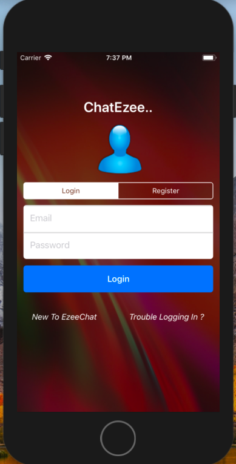
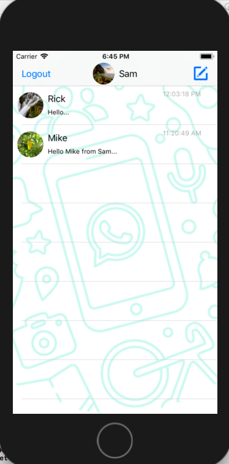
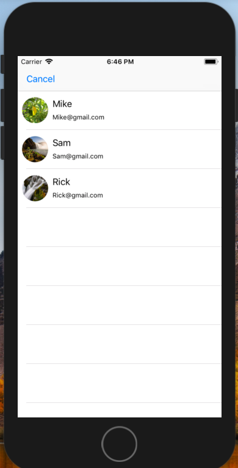
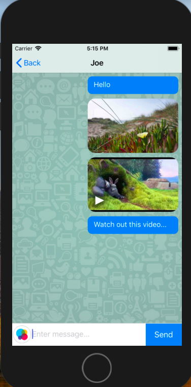
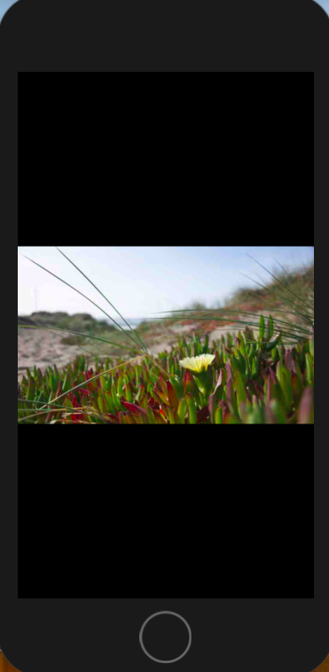

# EzeeChat

EzeeChat is an application that enables user to perform text chatting and media sharing among the contact list available over cloud created by the applicant user. 
As of now application support realtime text chatting where a user can register, login and initiate live chatting with the users available over firebase database.

# Technology Stack: 
Firebase
Swift Programming 4
Xcode 9.X
IOS 9.X

# Usage Instruction & Features
To get start with this app, user has to register and signin to the system.  This involves leveraging firebase authentication mechanism to allow user to login to the application. Login screen contains toggle button to switch over login screen and registration screen.
Main controller screen will fetch users from firebase database involved in chat. It also has a logout feature which directly takes user back to the login screen.

User list will be projected in a table view format with last interacted date time stamp. On click of cell, app takes you to the chatting board displaying entire chat history performed.
Landing page also contains a write message icon which opens up a new screen loaded with all available users from firebase. User can send a message to its contact just by tapping before cell.
Node structure to hold user messages will be in a form of a tree and stored in firebase database storage area.

Screen three involves handling of chat messages/history per user basis and message format as a bubble icon with color codes, this differentiates messages from users.

# Feel of an application 
   

# Update
Supporting image and video sharing among contacts, media content will be segregated and pushed onto to a storage area of firebase which will be identified by a unique id’s. Following screen shows the image and video sharing support through the chat window and also image zoom-in/zoom-out functionality has been added on tap...
 

# Next Task:
Deletion of chat history along with the user info shall be incorporated soon...

Progress about the application will be updated as n when the tasks are accomplished.

